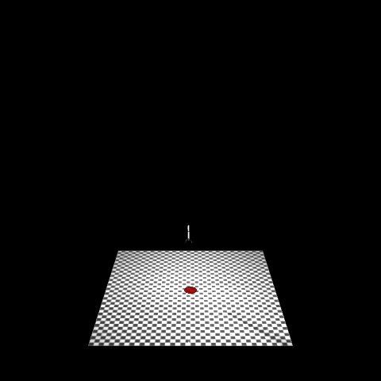

# SpaceX Rocket Landing Simulator

A SpaceX Falcon 9-style rocket landing simulator using MuJoCo physics and Soft Actor-Critic (SAC) reinforcement learning.



## Overview

Train an RL agent to land a rocket vertically on a target pad, similar to SpaceX Falcon 9 landings. The environment features:

- **Realistic physics**: MuJoCo simulation with 6-DOF free joint dynamics
- **Multiple rocket designs**: Simple cylinder (v0), two-leg (v1), and stable tripod (v2)
- **Domain randomization**: Configurable mass, thrust, gravity, and initial conditions
- **Detailed metrics**: Crash breakdowns, reward components, and video logging to W&B

## Setup

```bash
uv sync
source .venv/bin/activate
```

# GL MuJoCo Error

``` bash
export LD_PRELOAD=/usr/lib/x86_64-linux-gnu/libstdc++.so.6
```

# Use EGL for Headless Rendering
MuJoCo supports rendering through EGL, which is often compatible with headless servers. First, you need to ensure that MuJoCo is built with EGL support. Then, you can tell MuJoCo to use EGL instead of OpenGL by setting the MUJOCO_GL environment variable:

``` bash
export MUJOCO_GL=egl
```