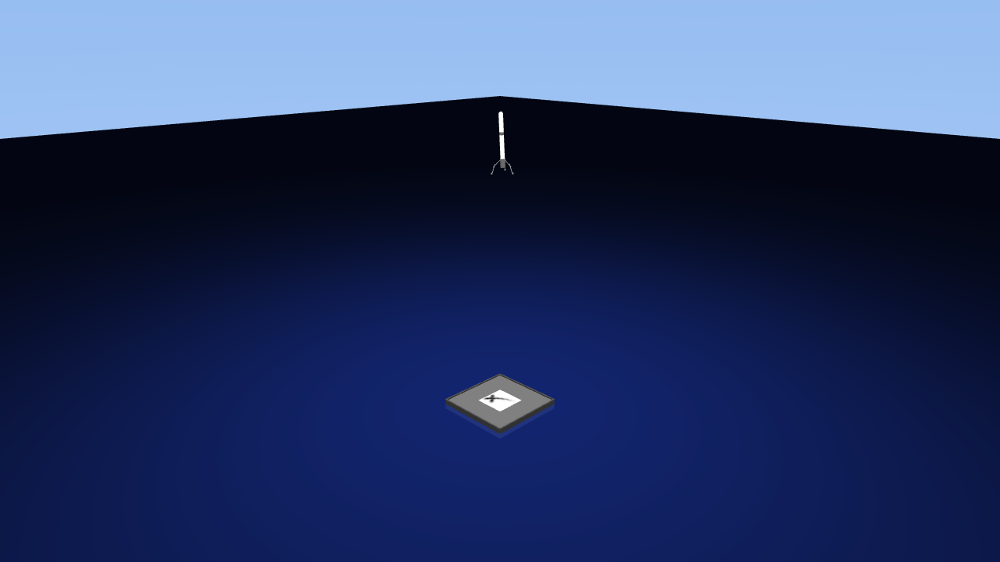
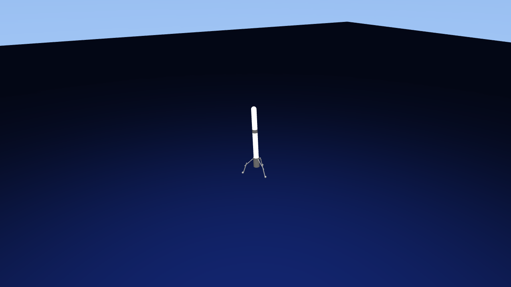
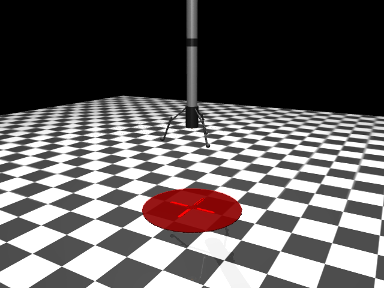

# SpaceX Rocket Landing Simulator

Train a reinforcement learning agent to land a rocket on a drone ship, SpaceX Falcon 9 style.

<p align="center">
  
</p>

## Features

- **MuJoCo physics** with 6-DOF free joint rocket dynamics
- **GPU-accelerated training** via MuJoCo Warp (4096 parallel envs, ~1M+ steps/sec)
- **PPO** (Proximal Policy Optimization) with GAE advantages
- **Curriculum learning** with progressive height stages (5m to 50m)
- **Domain randomization** for robust policies
- **Demo video renderer** with aerial and tracking camera angles

## Installation

Requires Python 3.10+ and an NVIDIA GPU for training.

```bash
# Clone and install dependencies
git clone <this-repo>
cd spaceX
uv sync

# For GPU training (MuJoCo Warp)
uv sync --extra gpu

# Activate environment
source .venv/bin/activate

# Required environment variables for MuJoCo rendering
export LD_PRELOAD=/usr/lib/x86_64-linux-gnu/libstdc++.so.6
export MUJOCO_GL=egl
```

## Training

PPO training with 4096 parallel GPU environments:

```bash
cd training/multi_rocket && python train_ppo.py
```

Training uses the simplified v0 rocket model (cylinder, no legs) for speed — collision detection with the v2 tripod legs is ~3x slower in MuJoCo Warp. The policy transfers directly to the full v2 model since the observation space, action space, and actuators are identical; the legs are passive geometry.

Training logs to [Weights & Biases](https://wandb.ai). Override any config parameter via CLI:

```bash
# Change seed
python train_ppo.py env.seed=123

# More environments
python train_ppo.py env.num_envs=8192

# Longer training
python train_ppo.py collector.total_frames=100_000_000

# Offline logging (no W&B upload)
python train_ppo.py logger.mode=offline
```

Checkpoints are saved to `training/multi_rocket/checkpoints/`.

## Demo Videos

Generate high-quality demo videos from a trained checkpoint:

```bash
python env/demo_render.py --checkpoint training/multi_rocket/checkpoints/ppo_final.pt
```

This produces two videos in `videos/`:

| Aerial view | Tracking view |
|:-----------:|:-------------:|
|  |  |

Options:

```bash
# Custom resolution and FPS
python env/demo_render.py --checkpoint <path> --resolution 720 --fps 30

# Override starting height
python env/demo_render.py --checkpoint <path> --height 30

# Custom output directory
python env/demo_render.py --checkpoint <path> --output-dir my_videos/
```

## Project Structure

```
training/multi_rocket/          PPO training (GPU, MuJoCo Warp)
  train_ppo.py                  Training script (Hydra + TorchRL)
  utils_ppo.py                  Environment and model creation
  config_ppo.yaml               Training configuration
  checkpoints/                  Saved model checkpoints

env/                            Shared environment code
  rocket_landing.py             Gymnasium MuJoCo env (CPU, single)
  rocket_landing_warp.py        MuJoCo Warp env (GPU, batched)
  demo_render.py                Demo video renderer
  config.py                     Configuration dataclasses
  rewards.py                    Reward calculator
  xml_files/                    MuJoCo XML model files
    single_rocket_test.xml      Training model (v0 cylinder, fast)
    rocket_v2_three_legs.xml    Full rocket model (v2 tripod with legs)
    demo_v0.xml                 Demo scene (ocean, drone ship, sky)

rocket_designs/                 Design docs and screenshots
LOGBOOK.md                      Development log and experiments
```

## Rocket Design

Two models share the same physics (mass, actuators, joint):

| v0 — Training (fast) | v2 — Demo (full detail) |
|:---------------------:|:-----------------------:|
|  |  |
| Simple cylinder | Tripod with landing legs |

Both have: 10 kg body, free joint (6 DOF), lateral thrust (x/y, 25N), main engine (z, 200N). The policy trained on v0 transfers to v2 since the legs are passive geometry that don't affect the control problem.

## License

MIT
