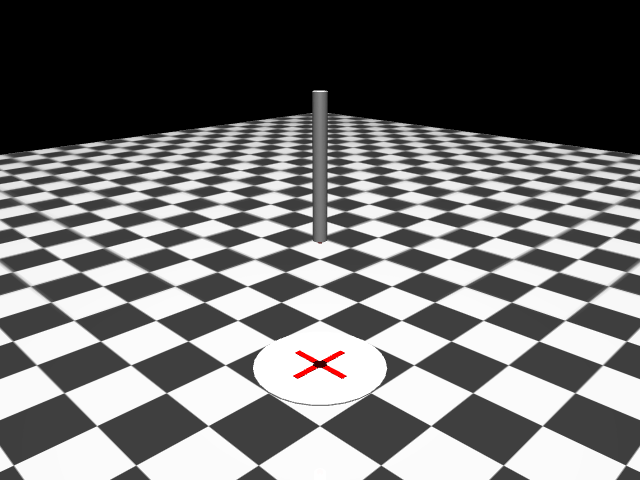

# Rocket Designs

This directory tracks iterations of the rocket model design for the SpaceX landing simulator.

## Design Versions

| Version | Screenshot | Description | Status | Height | Mass | Landed Z |
|---------|-----------|-------------|--------|--------|------|----------|
| [v0](design_v0.md) |  | Simple cylinder (baseline) | Deprecated | 2.0 m | 10.0 kg | 1.00 m |
| [v1](design_v1.md) |  | Three legs (tripod) | **Current** | ~4.1 m | 9.71 kg | 1.93 m |

## Physics Summary (All Designs)

| Parameter | Value | Notes |
|-----------|-------|-------|
| Starting height | 50 m | ~12× rocket height |
| Max vertical thrust | 200 N | Main engine |
| Max lateral thrust | 25 N | Attitude control |
| Thrust-to-weight ratio | ~2.0 | Can hover at ~50% throttle |
| Timestep | 0.005 s | MuJoCo step |
| Control rate | 40 Hz | frame_skip=5 |
| Freefall margin | ~2 m | From 50m, needs 48m to stop |

## File Structure

```
rocket_designs/
├── README.md           # This file
├── design_v0.md        # Version 0 documentation
├── design_v1.md        # Version 1 documentation
└── screenshots/        # Visual references
    ├── design_v0.png
    ├── design_v1.png
    ├── design_v1_side.png
    └── design_v1_top.png
```

## Creating a New Design

1. Create XML in `env/xml_files/rocket_vN_<description>.xml`
2. Generate screenshots using the capture script pattern
3. Create `design_vN.md` with:
   - Screenshots
   - Physical specifications table
   - Component breakdown
   - Actuator details
   - Changes from previous version
   - Known limitations
4. Update this README's version table

## Design Goals

- **2D focus**: Legs on ±X axis for side-view landing
- **Realistic proportions**: Match Falcon 9 style
- **Trainable**: Reasonable mass/thrust ratios for RL
- **Visual clarity**: Easy to assess orientation during training
