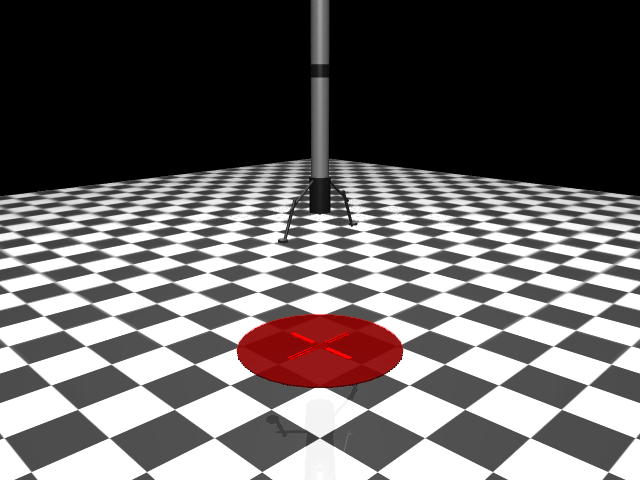
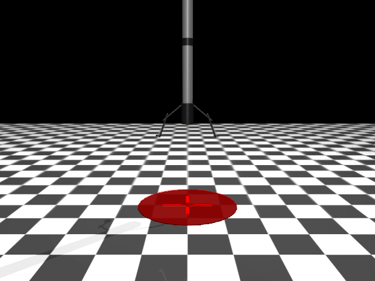

# Rocket Design v1 - Landing Legs (Deprecated)

> **Note:** Superseded by v2 with three legs for stable tripod landing.

## Screenshots

## Overview
Falcon 9-inspired rocket with deployed landing legs. Designed for 2D landing scenarios with legs positioned on opposite sides (X-axis).

## Physical Specifications

| Property | Value |
|----------|-------|
| Total height | ~3.6 m (body) + legs |
| Body radius | 0.15 m |
| Body length | 3.0 m |
| Total mass | ~10 kg |
| Leg span | ~1.4 m (tip to tip) |
| Starting height | 50 m |

## Body Components

| Part | Shape | Size | Mass |
|------|-------|------|------|
| Main body | Cylinder | r=0.15, h=3.0m | 8.0 kg |
| Nose cone | Capsule | r=0.15, h=0.6m | 0.5 kg |
| Interstage band | Cylinder | r=0.155, h=0.2m | 0.2 kg |
| Engine section | Cylinder | r=0.18, h=0.6m | 0.5 kg |

## Landing Legs (x2)
Each leg consists of:
- Upper strut: Capsule, angled 50° outward
- Lower strut: Capsule, angled 20° outward
- Foot pad: Cylinder, 0.08m radius

Legs are fixed (not deployable) and positioned on ±X axis for 2D landing.

## Actuators
Same as v0:

| Name | Gear | Range | Purpose |
|------|------|-------|---------|
| thrust_x | 25 | [-1, 1] | Lateral X control |
| thrust_y | 25 | [-1, 1] | Lateral Y control |
| thrust_z | 200 | [0, 1] | Main vertical thrust |

## Visual Features
- White main body with dark interstage band (SpaceX style)
- Dark engine section at bottom
- Gray/black landing legs with foot pads
- Larger landing target (1.5m radius)
- Additional fill light for better visibility

## Changes from v0
- Realistic proportions (taller, narrower)
- Added nose cone
- Added interstage visual band
- Added two landing legs with foot pads
- Better mass distribution
- Larger landing target
- Improved lighting

## Limitations
- Legs are fixed, not deployable
- Only 2 legs (optimized for 2D, not stable in 3D)
- No grid fins
- Thruster position may need adjustment for leg clearance

## XML File
`env/xml_files/rocket_v1_landing_legs.xml`
