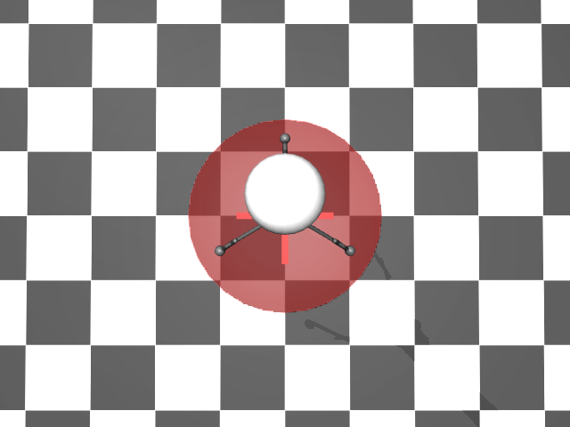
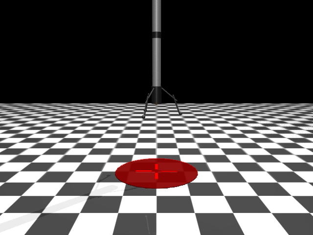

# Rocket Design v2 - Three Legs (Tripod)

## Screenshots

## Overview
Stable tripod landing configuration with 3 legs spaced 120° apart. Provides stable landing in all orientations.

## Physical Specifications

| Property | Value |
|----------|-------|
| Total height | ~4.1 m (nose to feet) |
| Body diameter | 0.30 m |
| Body length | 3.0 m (main cylinder) |
| Total mass | 9.71 kg |
| Leg span | ~0.85 m (center to foot) |
| Starting height | 50 m |
| Landed center height | 1.93 m |

## Physics Parameters

| Parameter | Value | Notes |
|-----------|-------|-------|
| Mass | 9.71 kg | Sum of all components |
| Weight | 95.3 N | At Earth gravity (9.81 m/s²) |
| Max vertical thrust | 200 N | thrust_z at ctrl=1.0 |
| Max lateral thrust | 25 N | thrust_x/y at ctrl=±1.0 |
| Thrust-to-weight ratio | 2.1 | Can hover at ~48% throttle |
| Max vertical accel | 10.8 m/s² | Net upward at max thrust |
| Max lateral accel | 2.6 m/s² | For attitude correction |
| Timestep | 0.005 s | MuJoCo simulation step |
| Control rate | 40 Hz | With frame_skip=5 |

## Landing Margin Analysis

From 50m freefall (worst case):
- Fall time: 3.2 s
- Impact velocity: 31.3 m/s
- Stopping distance needed: 48.1 m (at max thrust)
- **Safety margin: 1.9 m** (tight, requires early thrust)

## Body Components

| Part | Shape | Size | Mass |
|------|-------|------|------|
| Main body | Cylinder | r=0.15, h=3.0m | 8.0 kg |
| Nose cone | Capsule | r=0.15, h=0.6m | 0.5 kg |
| Interstage band | Cylinder | r=0.155, h=0.2m | 0.1 kg |
| Engine section | Cylinder | r=0.18, h=0.6m | 0.3 kg |

## Landing Legs (x3)
Three legs evenly spaced at 0°, 120°, 240°:
- Upper strut: Capsule, angled 50° outward
- Lower strut: Capsule, angled 20° outward
- Foot pad: Sphere, 0.06m radius (improved ground contact)
- Mass per leg: ~0.27 kg

## Actuators

| Name | Gear | Range | Purpose |
|------|------|-------|---------|
| thrust_x | 25 | [-1, 1] | Lateral X control |
| thrust_y | 25 | [-1, 1] | Lateral Y control |
| thrust_z | 200 | [0, 1] | Main vertical thrust |

## Changes from v1
- **3 legs instead of 2**: Stable tripod configuration
- **120° spacing**: Equal stability in all directions
- **Spherical foot pads**: Better ground contact than cylinders
- **Reduced leg mass**: Better balanced overall

## Advantages
- Stable landing regardless of yaw orientation
- No preferred landing direction
- Tripod naturally self-levels on uneven ground
- More realistic to actual rocket designs (Falcon 9 has 4 legs)

## XML File
`env/xml_files/rocket_v2_three_legs.xml`
